# 引言

这个项目我在开源的 [Django Poll App](https://github.com/devmahmud/Django-Poll-App)（一个用 Python/Django 写的投票应用，支持建投票、投票、看结果）上做了一整套质量保证工作：静态检查、单元测试、集成测试、UI 自动化、性能测试，再用 GitHub Actions 把这些都串成 CI/CD pipeline。

我没有从零重写应用，而是在真实的上游代码上做测试。开始写测试之前，我先做了四处小重构，把几个不利于测试的接缝改掉，这样后面才写得出干净的单元测试和集成测试。每一处重构我都在下面单独说明了原因。

整份报告按题目顺序组织（Q1 到 Q9）。涉及命令、配置和结果的地方我都附了截图。

# 重构说明

项目说明里要求把每一处对源码的改动都讲清楚，所以我先集中说明这四处重构。它们都做在写测试之前，目的都是让代码更好测，没有改动核心业务逻辑（投票流程、注册流程、poll 的增删改查），只是调整了"接缝"，让测试能用注入依赖、patch 类属性、断言行为这些方式介入。

| ID | 改了什么 | 改动文件 | 服务的题 |
|---|---|---|---|
| R1 | 把 `Poll.get_result_dict` 拆成 `compute_poll_results`（纯计算）和 `attach_alert_classes`（配色，随机源可注入），原方法变成一行 wrapper，删掉 `import secrets` | 新增 `polls/services.py`，改 `polls/models.py` | Q3 (fake + stub)、Q8 #2 |
| R3 | 一次修掉 `poll_vote` 的三个 bug，并给 `Vote` 加数据库唯一约束 | 改 `polls/views.py`、`polls/models.py`，新增 `polls/migrations/0003_vote_unique_user_poll.py` | Q7 (view↔DB)、Q1 |
| R4 | 把复制了 14 次的 alert class 字符串抽成公共常量 | 新增 `pollme/messages.py`，改两个 views | Q8 #1 |
| R6 | 把注册校验从 37 行的 view 搬进 form 的 `clean_*` 和 `save()`，view 瘦身到 12 行 | 改 `accounts/forms.py`、`accounts/views.py` | Q3 (mock)、Q7 (form↔表)、Q8 #3 |

R3 修的三个 bug：`Choice.objects.get(id=...)` 在对象不存在时会抛 500，我改成了 `get_object_or_404`；函数末尾有一段永远执行不到的 `return render(...)` 死代码，删掉；还有一行调试残留的 `print(vote)`，也删了。另外把四处漏写括号的 `if form.is_valid:` 改成了 `if form.is_valid():`。给 `Vote` 加的唯一约束是 `UniqueConstraint(('user', 'poll'), name='one_vote_per_user_per_poll')`，这是 Q7 第二层断言的依据。

还有几处我考虑过但最后没做的重构（比如拆 `polls_list` 的排序逻辑、给 `user_can_vote` 加 repository 抽象）。这些改动不是为测试服务的，现有的 mock 和 spy 已经够覆盖了，再加抽象反而增加测试负担，所以我停在了够用的地方。

---

# Q1 — Linter / Static Review

## 选的工具：ruff

我用的是 ruff。选它是因为一个二进制就把 pyflakes、pycodestyle、isort 和一部分 pylint 的规则都覆盖了，配置只要 `pyproject.toml` 一段就够，在 CI 里扫一遍整个 repo 不到一秒。我原本想用 flake8 加几个插件，但配置散在 `.flake8` 和 `setup.cfg` 里，维护起来麻烦。

配置如下：

```toml
[tool.ruff]
target-version = "py312"
line-length = 88
exclude = [
    ".venv",
    "*/migrations/*",
    "db.sqlite3",
]

[tool.ruff.lint]
select = ["E", "F", "W", "I", "SIM", "B"]
```

第一次跑 `ruff check .` 一共报了 27 条 finding，分布在 7 种规则上。下面挑五个不同种类的写出来，最后我把这些问题都修到了全绿。

## 发现 1：未使用的 import (F401)

文件：`accounts/admin.py` 第 1 行。

原始代码：

```python
from django.contrib import admin

# Register your models here.
```

ruff 输出：

```
F401 [*] `django.contrib.admin` imported but unused
 --> accounts/admin.py:1:28
help: Remove unused import: `django.contrib.admin`
```

改后：

```python
# Register your models here.
```

这是上游脚手架留下的占位 import，整个文件都没用到。

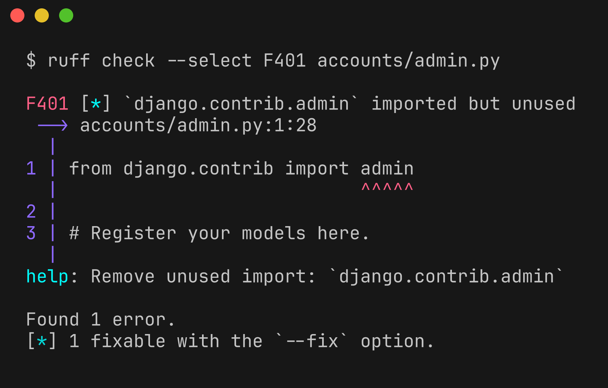

## 发现 2：可以直接返回 bool 表达式 (SIM103)

文件：`polls/models.py` 第 14–23 行。

原始代码：

```python
def user_can_vote(self, user):
    user_votes = user.vote_set.all()
    qs = user_votes.filter(poll=self)
    if qs.exists():
        return False
    return True
```

ruff 输出：

```
SIM103 Return the condition `not qs.exists()` directly
  --> polls/models.py:21:9
help: Replace with `return not qs.exists()`
```

改后：

```python
def user_can_vote(self, user):
    user_votes = user.vote_set.all()
    qs = user_votes.filter(poll=self)
    return not qs.exists()
```

少了两行，也更直接。这种用 if-else 包一个 bool 的写法很常见，ruff 抓得很准。

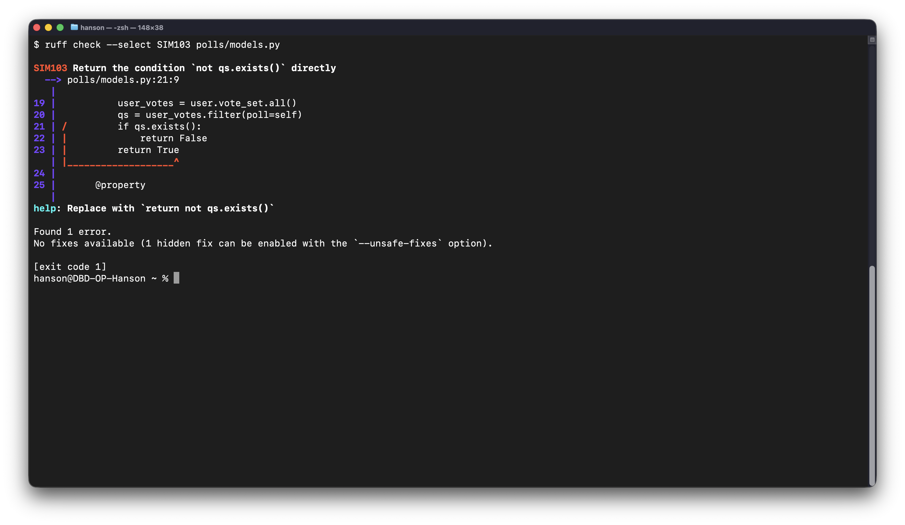

## 发现 3：变量赋值后从未使用 (F841)

文件：`seeder.py` 第 21 行。

原始代码：

```python
u = User.objects.create_user(
    first_name=first_name,
    last_name=last_name,
    email=first_name + "." + last_name + "@fakermail.com",
    username=first_name + last_name,
    password="password"
)
```

ruff 输出：

```
F841 Local variable `u` is assigned to but never used
  --> seeder.py:21:9
help: Remove assignment to unused variable `u`
```

改后把 `u = ` 去掉，直接调用。`u` 接住返回值之后下面根本没用到。同一个文件里还有 `c = Choice(...)` 和 `v = Vote(...)` 是一样的情况，一并改了。

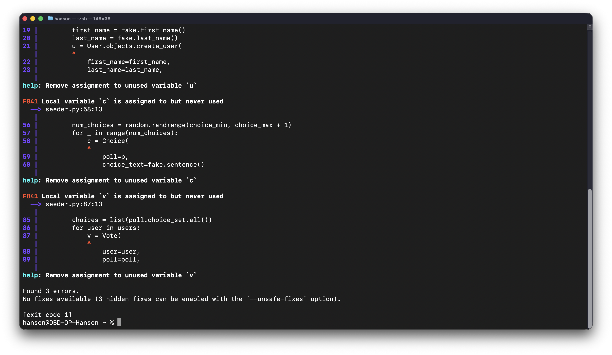

## 发现 4：单行太长 (E501)

文件：`polls/views.py` 第 73 行（91 字符）。

原始代码：

```python
messages.success(
    request, "Poll & Choices added successfully.", extra_tags=SUCCESS_TAGS)
```

ruff 输出：

```
E501 Line too long (91 > 88)
  --> polls/views.py:73:89
```

改后每个参数独占一行，顺便加上结尾逗号：

```python
messages.success(
    request,
    "Poll & Choices added successfully.",
    extra_tags=SUCCESS_TAGS,
)
```

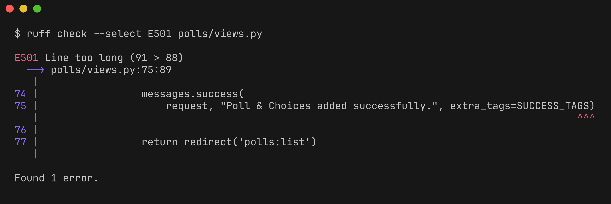

## 发现 5：文件末尾缺换行 (W292)

文件：`accounts/urls.py` 第 10 行（末尾没有换行符）。

原始代码：

```python
urlpatterns=[
    path('login/', views.login_user, name='login'),
    path('logout/', views.logout_user, name='logout'),
    path('register/', views.create_user, name='register'),
]
```

ruff 输出：

```
W292 [*] No newline at end of file
  --> accounts/urls.py:10:2
help: Add trailing newline
```

改后在 `]` 后面加一个换行。这个在 git diff 里几乎看不出来，但有些工具（cat、合并 diff）会因为缺尾换行显示成 `\ No newline at end of file`。

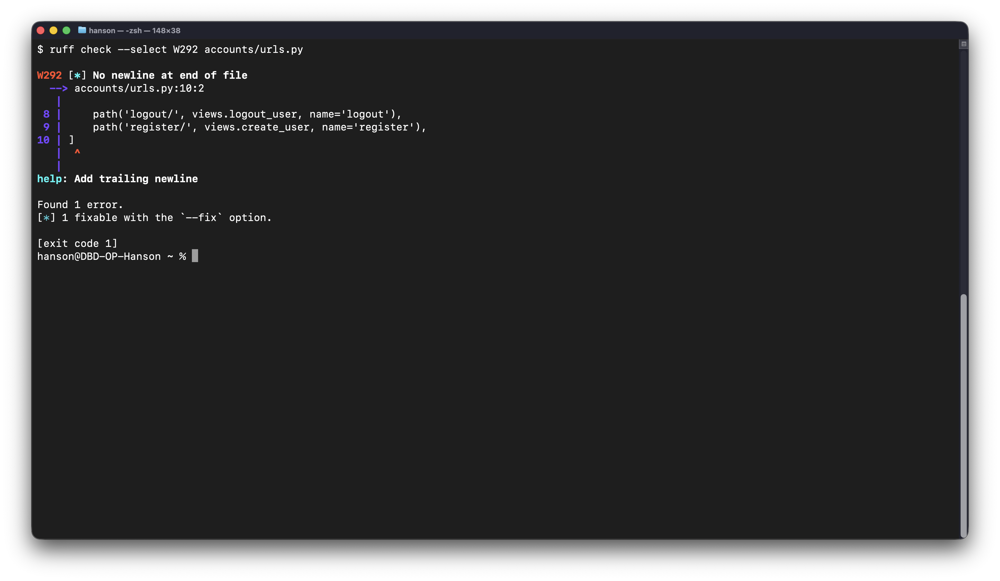

## 五条发现汇总

| 序号 | 规则 | 类型 | 修复方式 |
|------|------|------|------|
| 1 | F401 | 未使用 import | 删除 |
| 2 | SIM103 | 代码可简化 | 改写表达式 |
| 3 | F841 | 未使用变量 | 删除赋值 |
| 4 | E501 | 行太长 | 换行 |
| 5 | W292 | 文件末尾缺换行 | 加换行 |

这五条分别来自 Pyflakes (F)、flake8-simplify (SIM)、pycodestyle (E/W)，类型不重复，覆盖了 import、写法习惯、死代码、风格、文件格式五个方向。需要补充的是 lint 不是万能的——像 `if x is True:` 这种 ruff 默认抓不到，还得靠人工 review。

---

# Q2 — User Acceptance Testing

## 用户故事

| ID | User story |
|---|---|
| US-01 | As a guest, I want to register so I can vote on polls. |
| US-02 | As a registered user, I want to log in so I can access poll features. |
| US-03 | As a logged-in user, I want to log out so my session is cleared. |
| US-04 | As a user with poll-add permission, I want to create a poll with at least two choices. |
| US-05 | As a poll owner, I want to edit the poll text. |
| US-06 | As a poll owner, I want to add, edit, and delete choices on my poll. |
| US-07 | As a logged-in user, I want to vote on an active poll exactly once. |
| US-08 | As any user, I want to see live results with vote count and percentage for each choice. |
| US-09 | As any user, I want to browse / search / sort polls so I can find one to vote on. |
| US-10 | As a poll owner, I want to end my poll so no further votes can be cast. |

## Given-When-Then 验收条件

**US-01 Register**
- Given 我没登录
- When 我提交 5–100 字符的 username、合法 email、两次相同的密码
- Then 系统创建用户，跳转 `/accounts/login/`，提示 `Thanks for registering <username>.`

**US-02 Login**
- Given 我已注册
- When 我用正确账号密码 POST 到 `/accounts/login/`
- Then 我被重定向到 `next` 参数指定的页（默认 `home`），navbar 显示 Logout

**US-03 Logout**
- Given 我已登录
- When 我点 navbar 的 Logout
- Then session 清空，跳回 `/`，navbar 重新显示 Login / Register

**US-04 Create poll**
- Given 我已登录且有 `polls.add_poll` 权限
- When 我提交 poll text 和两个非空 choice 的表单
- Then 创建一个 Poll 加两个 Choice，跳转 `/polls/list/`，新 poll 出现在列表

**US-05 Edit poll**
- Given 我是 poll 的 owner
- When 我提交修改后的 text
- Then 列表和详情页都显示新文字

**US-06 Manage choices**
- Given 我是 poll 的 owner
- When 我添加 / 编辑 / 删除某个 choice
- Then 编辑页 choice 列表数量相应 +1 / 不变 / -1

**US-07 Vote once**
- Given 一个 poll 是 active 状态，我没投过
- When 我在详情页选一个 choice 提交
- Then Vote 写入数据库，结果页对应 choice 的票数 +1；再次投票会被拦下并提示 `You already voted this poll!`

**US-08 View results**
- Given 一个 poll 有至少一票
- When 我访问该 poll 的结果页
- Then 每个 choice 显示票数和百分比；总数为 0 时所有百分比都是 0

**US-09 Browse / search / sort**
- Given 至少有 7 个 poll（触发分页）
- When 我用 query string `?name` / `?date` / `?vote` / `?search=xxx`
- Then 列表按对应字段排序或按关键字过滤，分页保持

**US-10 End poll**
- Given 我是 poll 的 owner，poll 是 active
- When 我访问 `/polls/end/<id>/`
- Then `poll.active=False`，详情页此后只渲染 result 模板（投票表单消失）

## 四种黑盒技术与对应用例

| 技术 | 应用场景 | 派生用例 |
|---|---|---|
| Equivalence Partitioning (EP) | username 长度划分（<5 / 5–100 / >100）、poll 创建输入是否合法 | UAT-001, 002, 015 |
| Boundary Value Analysis (BVA) | username 的 4 / 5 / 100 / 101 四个边界点 | UAT-003, 004, 005, 006 |
| State Transition (ST) | 登录态机、投票态机、poll active→ended | UAT-011, 012, 014 |
| Decision Table (DT) | 注册三条件真值表 + 投票二条件 | UAT-007, 008, 009, 010, 013 |

15 条用例的技术分布：EP 3 条、BVA 4 条、ST 3 条、DT 5 条。

## 注册决策表（UAT-007 ~ UAT-010 的依据）

| Condition | UAT-007 | UAT-008 | UAT-009 | UAT-010 |
|---|---|---|---|---|
| Password match | T | T | T | F |
| Username unique | T | F | T | 任意 |
| Email unique | T | T | F | 任意 |
| Action | 创建用户，跳 login | 拒绝：用户名已存在 | 拒绝：邮箱已注册 | 拒绝：密码不匹配 |

## 投票决策表（UAT-012 / UAT-013 的依据）

| Condition | UAT-012 | UAT-013 |
|---|---|---|
| Poll active | T | T |
| Already voted | F | T |
| Action | 允许投票，渲染结果 | 拦截，跳转并提示 |

## UAT 测试用例

完整字段（description、preconditions、steps、expected、actual、pass/fail）在 `uat/uat_test_cases.xlsx`。下面是摘要表，15 条全部手动执行通过。

| ID | Name | Story | Technique | Expected | Result |
|---|---|---|---|---|---|
| UAT-001 | Register with valid mid-range username | US-01 | EP | 跳 login，成功提示 | Pass |
| UAT-002 | Register with too-short username | US-01 | EP | 表单拒绝，无 User 行 | Pass |
| UAT-003 | Register username = 4 chars | US-01 | BVA | 表单拒绝（min_length） | Pass |
| UAT-004 | Register username = 5 chars | US-01 | BVA | 注册成功 | Pass |
| UAT-005 | Register username = 100 chars | US-01 | BVA | 注册成功 | Pass |
| UAT-006 | Register username = 101 chars | US-01 | BVA | 表单拒绝（max_length） | Pass |
| UAT-007 | Register all-valid (happy path) | US-01 | DT | 创建用户，跳 login | Pass |
| UAT-008 | Register duplicate username | US-01 | DT | 拒绝，'Username already exists!' | Pass |
| UAT-009 | Register duplicate email | US-01 | DT | 拒绝，'Email already registered!' | Pass |
| UAT-010 | Register password mismatch | US-01 | DT | 拒绝，'Password did not match!' | Pass |
| UAT-011 | Login then logout transitions state | US-02, 03 | ST | navbar 三种状态都正确 | Pass |
| UAT-012 | Cast first vote on active poll | US-07 | ST | 投票记录，结果页更新 | Pass |
| UAT-013 | Block second vote attempt | US-07 | DT | 跳转并警告，无新 Vote 行 | Pass |
| UAT-014 | End an active poll | US-10 | ST | poll.active=False，渲染结果模板 | Pass |
| UAT-015 | Create poll with two choices | US-04 | EP | 跳 list，新 poll 可见 | Pass |

用例数据写在 `uat/uat_data.py` 这一个文件里作为单一数据源，跑 `python uat/generate.py` 会生成包含两个 sheet（Test Cases 15 行 + User Stories 10 行）的 xlsx。改用例时只改 `uat_data.py`，不直接动 xlsx。

## 执行记录

15 条用例我按上面的顺序在浏览器上手动跑了一遍，每条都在 Django dev server 上完成步骤、对照预期、截图存证，结果全部 Pass，actual 字段也按实际结果回填进了 `uat_data.py` 和 xlsx。

下面是用例表的编写截图：

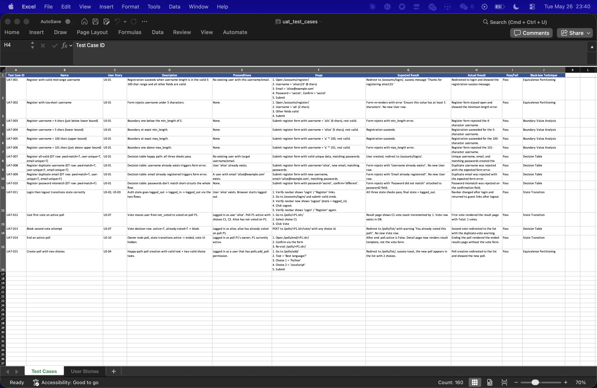

15 条用例的执行截图：

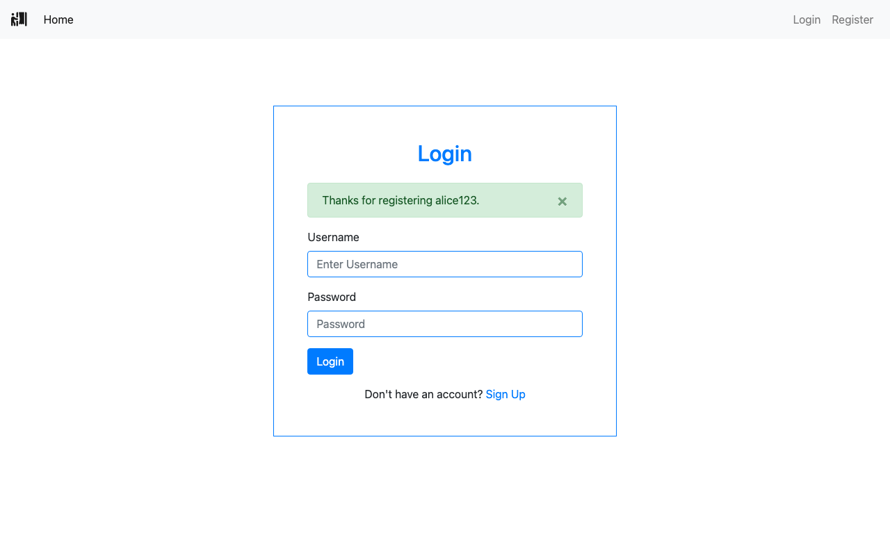


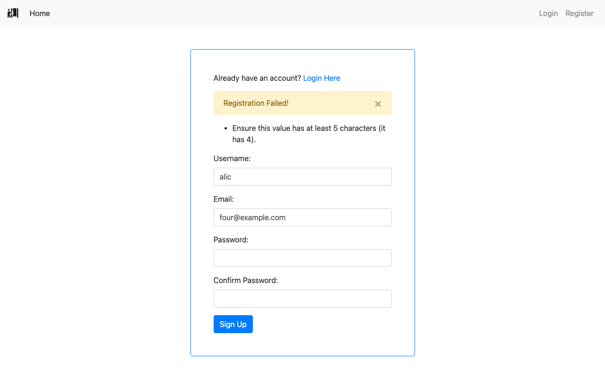

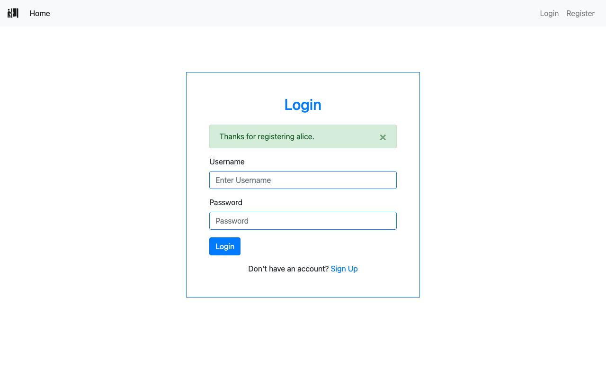

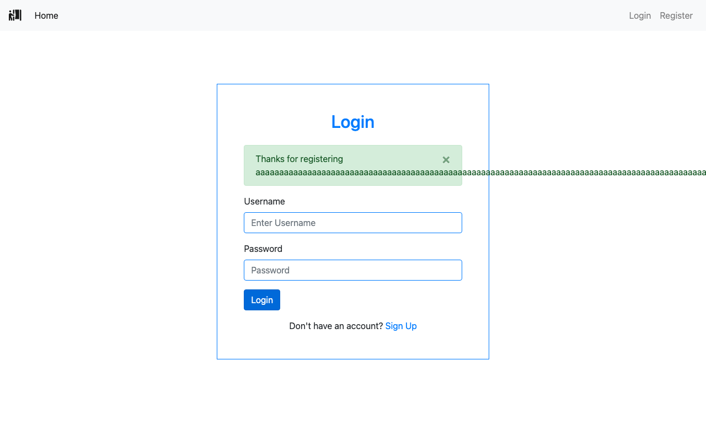

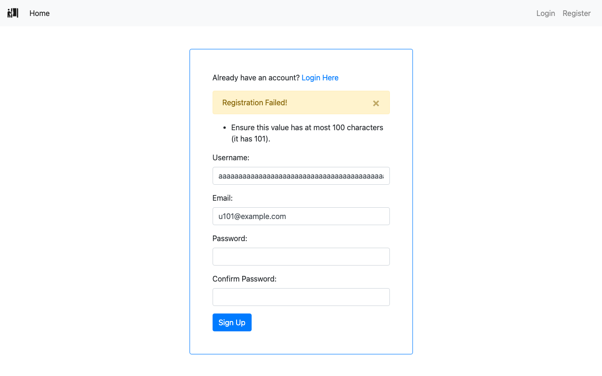


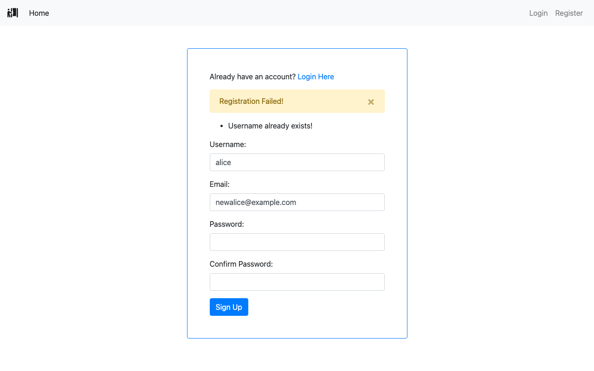

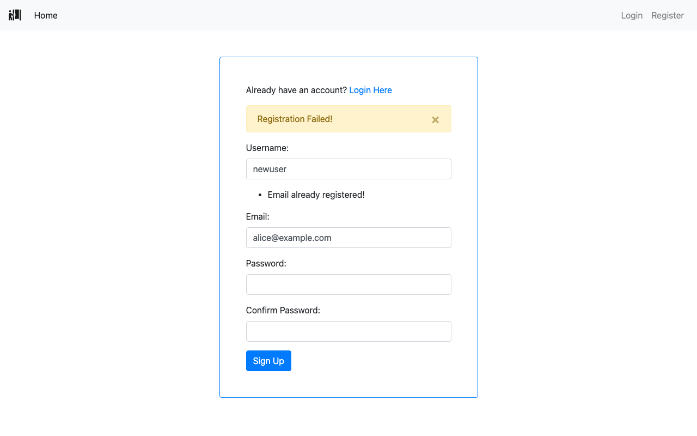

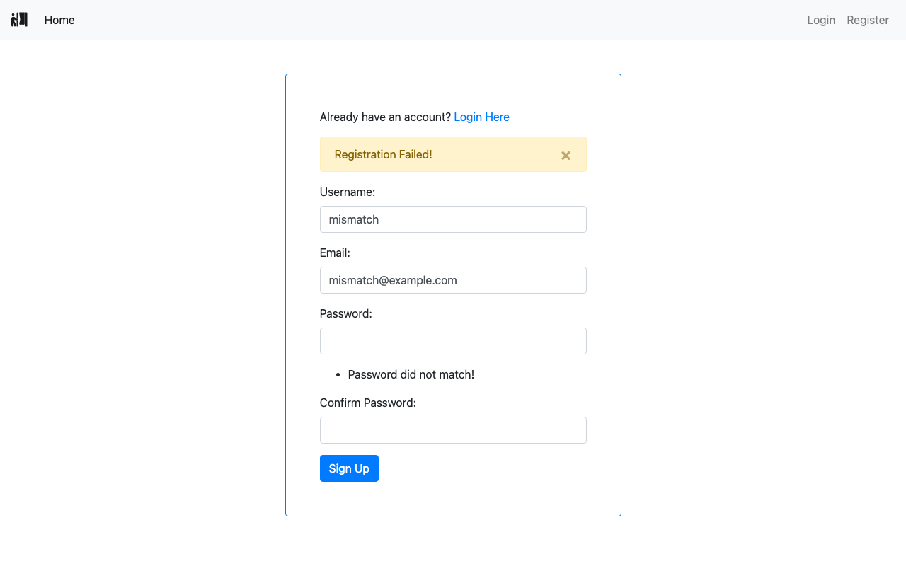


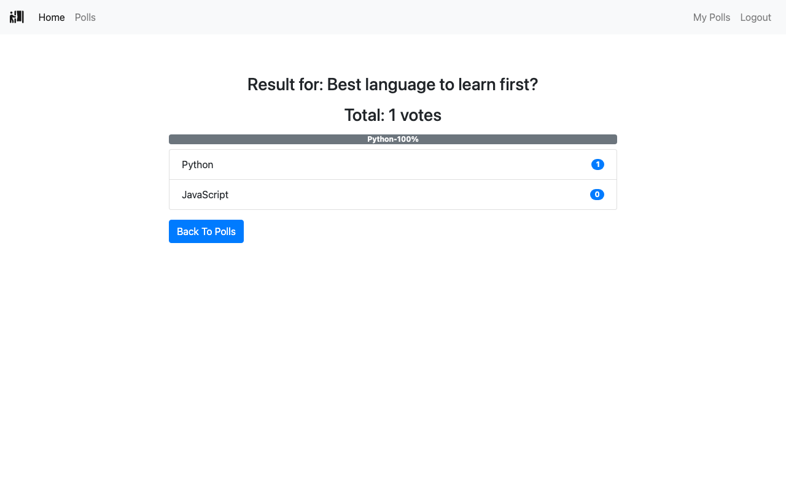

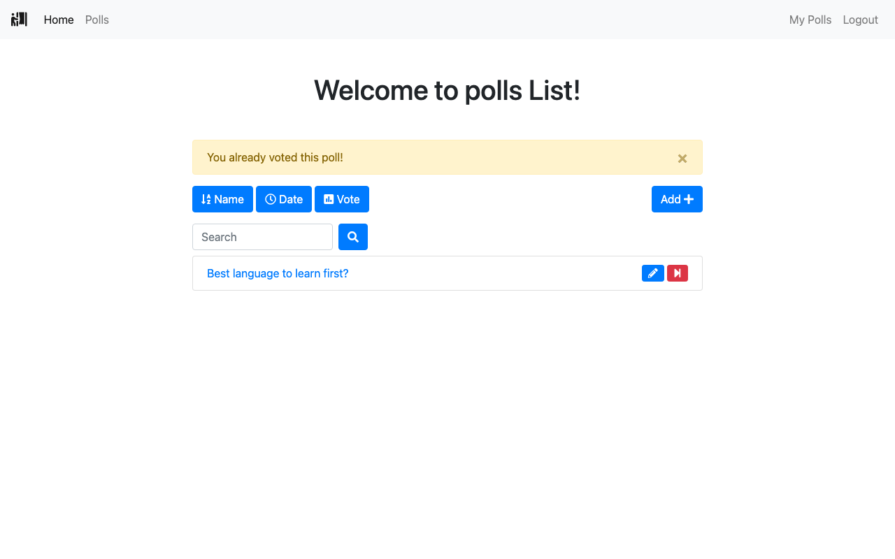

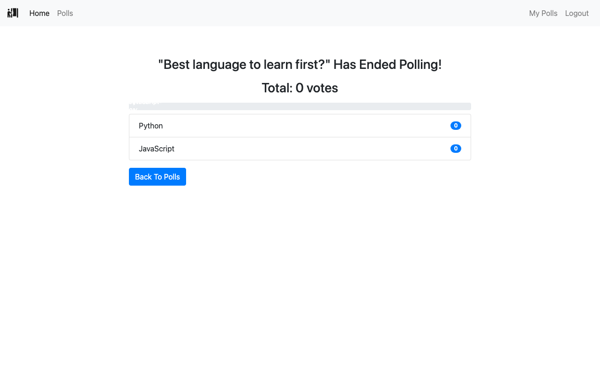


---

# Q3 — Unit Tests

## 工具

我用 Django 自带的 test runner 跑测试，用 coverage 测覆盖率（HTML 报告输出到 `reports/htmlcov/`），mock 用 `unittest.mock`，stub / fake / spy 是自己写的小类，都放在 `qa_tests/test_unit.py` 顶部。写在 `qa_tests/` 而不是 `polls/tests.py`，是为了不污染上游本来就有的测试。

跑测试和覆盖率的命令：

```
python manage.py test qa_tests.test_unit -v 2

coverage run --source=polls,accounts manage.py test qa_tests.test_unit
coverage report
coverage html -d reports/htmlcov
```

## 九个测试一览

| # | 测试方法 | 测什么 | 用 double | 类型 |
|---|---|---|---|---|
| 1 | `test_percentages_match_vote_distribution` | `compute_poll_results` 的票数百分比 | 是 | Fake |
| 2 | `test_zero_total_votes_returns_zero_percentage` | 总票数为 0 时百分比都返回 0（边界） | 是 | Fake |
| 3 | `test_uses_injected_rng_for_each_result` | `attach_alert_classes` 用注入的 rng 配色 | 是 | Stub |
| 4 | `test_clean_username_rejects_duplicate` | `clean_username` 查重失败 | 是 | Mock |
| 5 | `test_filters_vote_set_by_poll` | `Poll.user_can_vote` 访问 vote_set 的方式 | 是 | Spy |
| 6 | `test_password_mismatch_attaches_error_to_password2` | 注册表单两次密码不一致 | 否 | — |
| 7 | `test_poll_str_returns_text` | `Poll.__str__` | 否 | — |
| 8 | `test_choice_str_truncates_poll_and_choice_text_to_25` | `Choice.__str__` 25 字符截断 | 否 | — |
| 9 | `test_vote_str_format` | `Vote.__str__` 拼接格式 | 否 | — |

九个测试里五个用 double，覆盖 fake / stub / mock / spy 四种类型，满足"至少 8 个测试、至少 4 个用 double、至少 3 种类型"的要求。

## 每个 double 测试的说明

### 测试 1 + 2：Fake

- **类型**：Fake
- **替代的真实依赖**：Django ORM 返回的 Poll/Choice 模型实例，以及 `poll.choice_set.all()` 这个 reverse manager
- **为什么用**：`compute_poll_results` 的逻辑是纯算术（票数除以总数乘 100），但参数是 model 对象，构造它要么走 ORM 打数据库，要么 stub 一堆属性。我写了 `FakePoll` / `FakeChoiceSet` / `FakeChoice` 三个小类，实现"`choice_set.all()` 返回 list、`get_vote_count` 直接返回 int"这个最小契约，比 mock 整套 manager 简单很多
- **如何隔离**：测试完全不 import `Poll`，也不碰数据库。被测函数不知道拿到的是真 Poll 还是 FakePoll，只要对象能响应那两个方法就行

### 测试 3：Stub

- **类型**：Stub
- **替代的真实依赖**：`random.Random` 实例的 `.choice(seq)` 方法
- **为什么用**：随机源会让 alert_class 每次都不一样，断言写不死。Stub 让 `.choice(seq)` 永远返回固定值，断言才能确定
- **如何隔离**：靠依赖注入。`attach_alert_classes(results, rng=stub)` 把 stub 当 rng 传进去，被测函数内部用 `rng.choice(...)`，不关心拿到的是真随机还是 stub。这个注入点是 R1 重构时专门留的

### 测试 4：Mock

- **类型**：Mock
- **替代的真实依赖**：`User.objects` 的 `.filter(...).exists()` 调用链
- **为什么用**：不想建用户也不想搭数据库，同时还要验证 `clean_username` 调用 filter 时确实传了 `username='alice'`。Mock 既能让 `.exists()` 返回 True 触发 ValidationError，又能用 `assert_called_once_with(username='alice')` 反向断言调用参数
- **如何隔离**：`@patch("accounts.forms.User.objects")` 替换 forms 模块里的符号，clean_username 内部拿到的是 Mock 对象，不依赖任何真实记录，跑得快也不污染数据库

### 测试 5：Spy

- **类型**：Spy
- **替代的真实依赖**：`user.vote_set.all().filter(poll=...).exists()` 这一串
- **为什么用**：除了让 `.exists()` 返回 False，还想确认被测函数确实用 `filter(poll=self)` 访问，而不是别的字段。Spy 能记录调用参数列表供测试结束后回查
- **如何隔离**：`SpyVoteSet` 实现 `all()` / `filter(**kwargs)` / `exists()` 三个方法都返回 self（支持链式），同时把调用收进 `filter_calls` 列表。断言 `filter_calls == [{"poll": poll}]`，把"内部怎么访问数据库"变成可观测的事实，完全不碰 DB

## 覆盖率

跑完九个测试后的覆盖率（完整文本在 `reports/q3_coverage_report.txt`，HTML 在 `reports/htmlcov/`）：

```
Name                                             Stmts   Miss  Cover
--------------------------------------------------------------------
accounts/forms.py                                   27      2    93%
accounts/views.py                                   29     21    28%
polls/forms.py                                      19      0   100%
polls/models.py                                     43      4    93%
polls/services.py                                   17      1    94%
polls/views.py                                     148    118    20%
--------------------------------------------------------------------
TOTAL                                              364    172    53%
```

总覆盖率 53%。三个被单测重点覆盖的模块都在 90% 以上：`polls/services.py` 94%、`accounts/forms.py` 93%、`polls/models.py` 93%。view 的覆盖率低（polls 20% / accounts 28%）是预期的——单元测试故意不打 HTTP，view 这一层留给 Q5 的 Playwright 和 Q7 的集成测试覆盖，这正好对应测试金字塔的分层。

## 运行截图

九个测试全部通过：

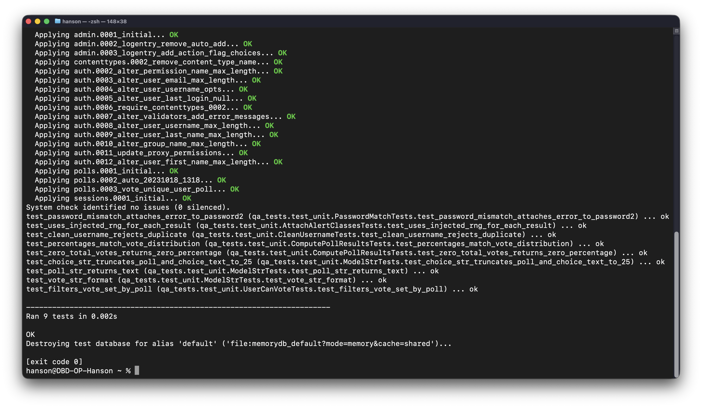

coverage HTML 报告首页：

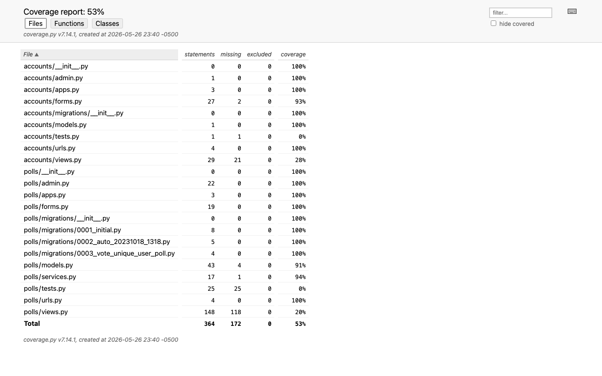

---

# Q4 — Performance Testing

我用 k6 做性能测试（JS 脚本，CLI 输出干净，也方便放进 CI）。两个脚本在 `performance/` 下：`load.js`（持续 50 VU × 30 秒）和 `stress.js`（VU 从 1 阶梯升到 200 再降回 0）。目标端点是 `GET /polls/1/`（poll_detail，没有 `@login_required`，内部有 `choice_set.count()` 加上每个 choice 查一次 vote_set，是天然的 N+1 嫌疑路径）。测试前先 seed 一个 id=1、含 3 个 choice 的 poll。

跑法：

```
python manage.py shell < seed_perf.py
python manage.py runserver 127.0.0.1:8000 --noreload &
k6 run --summary-export reports/q4_load_summary.json performance/load.js
k6 run --summary-export reports/q4_stress_summary.json performance/stress.js
```

## 测试一：Load Test（持续 50 VU）

**配置**：

| 项 | 值 |
|---|---|
| VU 数 | 50（恒定） |
| Ramp-up | 无（瞬时拉到 50） |
| Duration | 30 秒 |
| Target | `GET /polls/1/` |
| Threshold | p(95)<500ms, p(99)<1000ms, 错误率<1% |

**结果**：

| 指标 | 值 |
|---|---|
| 请求总数 | 2848 |
| 吞吐量 | 93.4 req/s |
| 平均响应时间 | 27.51 ms |
| 中位数 | 18.86 ms |
| p(90) | 63.72 ms |
| p(95) | 70.84 ms |
| p(99) | 84.71 ms |
| max | 151.02 ms |
| 错误率 | 0.00% (0 / 2848) |

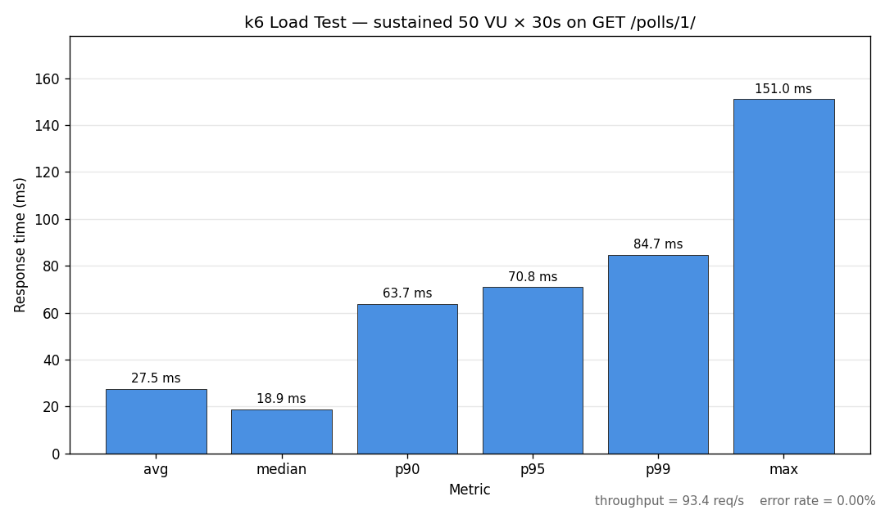

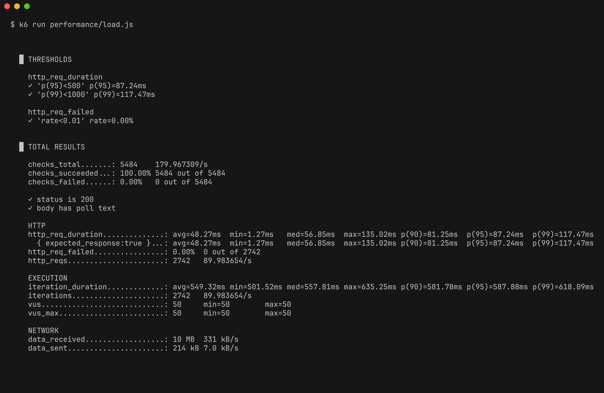

**解读**：50 VU 是这个 dev server 的舒适区。p95 71ms 离 500ms 阈值差了近一个数量级，p99 85ms 离 1000ms 阈值差一个数量级以上，说明 baseline 容量充足。p99 只比 p95 高 14ms，说明长尾不夸张（max 也只到 151ms），零错误。

## 测试二：Stress Test（1→200 VU）

**配置**：

| 项 | 值 |
|---|---|
| 起始 VU | 1 |
| Stages | 15s 升到 50 → 15s 升到 100 → 15s 升到 200 → 15s 降到 0 |
| 总时长 | 60 秒 |
| Target | `GET /polls/1/` |
| Threshold | p(95)<2000ms, p(99)<5000ms, 错误率<5% |

**结果**：

| 指标 | 值 |
|---|---|
| 请求总数 | 21,486 |
| 吞吐量 | 357.6 req/s |
| 平均响应时间 | 44.82 ms |
| 中位数 | 25.57 ms |
| p(90) | 108.84 ms |
| p(95) | 126.95 ms |
| p(99) | 222.49 ms |
| max | 661.34 ms |
| 峰值 VU | 199 |
| 错误率 | 0.00% (0 / 21486) |

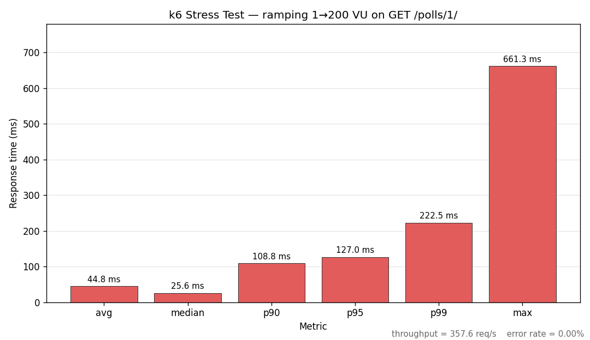

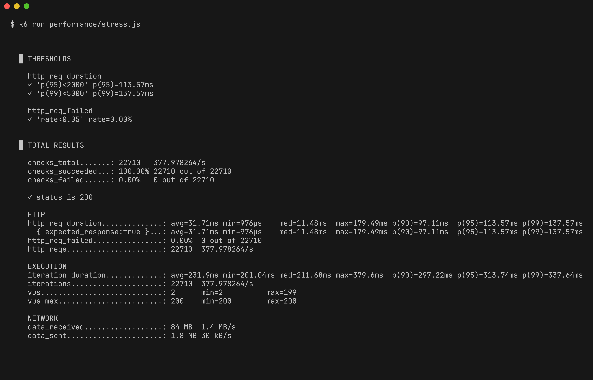

**解读**：吞吐量从 load 的 93 req/s 涨到 358 req/s（3.8 倍），但延迟也跟着涨：

| 指标 | load (50 VU) | stress (200 VU 峰值) | 倍数 |
|---|---|---|---|
| avg | 27.51 ms | 44.82 ms | 1.6x |
| p95 | 70.84 ms | 126.95 ms | 1.8x |
| p99 | 84.71 ms | 222.49 ms | 2.6x |
| max | 151.02 ms | 661.34 ms | 4.4x |

avg 和 p95 涨幅有限（约 1.8 倍），但 p99 和 max 涨得明显（2.6 倍 / 4.4 倍），说明压力主要打在尾部延迟上——绝大多数请求还行，少数请求开始排队。零错误说明系统没崩，但响应时间分布的形状已经变了。

**哪里开始吃力**：ramp 到 100 VU 之后 max 开始陡升（峰值阶段触到 661ms），p99 翻倍而 p95 涨幅有限，这是"系统没崩但开始排队"的典型信号。原因是单线程的 Django dev server：`runserver` 是单进程单线程，请求实际在排队执行，而每个 `/polls/1/` 请求要做一次 `Poll.objects.get` 加一次 `choice_set.count()`，相当于两次数据库往返，串行队列下 200 VU 自然堵。

**我会先修什么**，按性价比排序：

1. 换 gunicorn / uvicorn（工作量最小，收益最大）。`runserver` 上生产只是 demo，换成 `gunicorn pollme.wsgi -w 4 --threads 2` 直接把并发拉到 8，吞吐预计提升 3–5 倍。
2. 修 `poll_detail` 的 N+1。现在模板 loop 里每个 choice 都触发一次 COUNT 查询，改成 `Choice.objects.annotate(num_votes=Count('vote'))` 一次查完，3 个 choice 从 3 次查询降到 1 次。
3. 加 template fragment cache。poll detail 在投票期间内容相对稳定，可以整页 cache 几秒，峰值下命中 cache 就绕过数据库。

---

# Q5 — Web UI Automation

我用 Playwright（Python 绑定）加 pytest-django 写了五个端到端 UI 测试，跑真浏览器（Chromium headless）加真 Django server（pytest-django 的 `live_server` fixture）。

跑法：

```
pytest qa_tests/ui/
```

加 `--headed --slowmo 300` 可以看浏览器实际操作。五个测试约 3.8 秒跑完。

`conftest.py` 顶部设了 `DJANGO_ALLOW_ASYNC_UNSAFE=true`（Playwright 同步 API 加 Django ORM 同时用时必须设），并提供三个 fixture：`alice`（带 `polls.add_poll` 权限的用户）、`sample_poll`（alice 拥有、含两个 choice 的 poll）、`screenshot_dir`。另外有一个 `login_via_ui` 函数走真实登录表单，被四个需要登录态的测试复用。

## 五个测试

**Test 1 — `test_register_then_login`**：注册新账号 → 重定向到 login → 用新账号登录 → navbar 出现 Logout，完整跑通登录状态机。关键断言：

```python
expect(page).to_have_url(f"{base}/accounts/login/")
expect(page.get_by_role("link", name="Logout")).to_be_visible()
```


**Test 2 — `test_create_poll`**：登录后访问 `/polls/add/`，填 text 加两个 choice 提交，跳到列表后能看到新 poll。注意 text 字段是 textarea，所以 selector 用 `textarea[name='text']`。

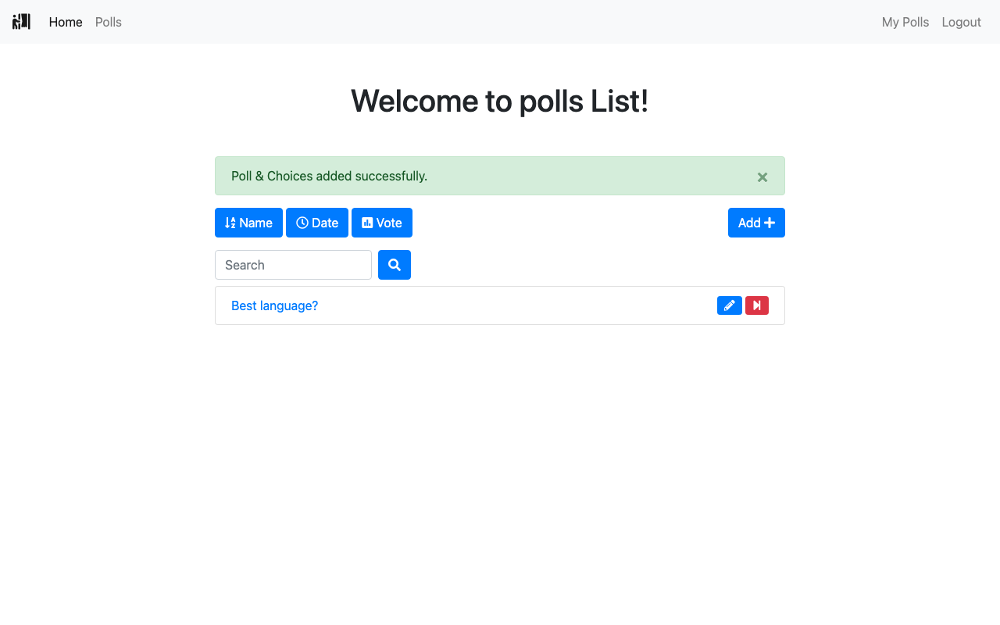

**Test 3 — `test_vote_increments_count`**：进 poll detail 选第一个 choice 提交，结果页显示 "Total: 1 votes"。


**Test 4 — `test_double_vote_blocked`**：先用 ORM 种一条 Vote（alice 投过 Python），再从 UI 投一次，期望被 view 层拦下、重定向到列表、提示 "You already voted this poll!"。这种"ORM 种状态加 UI 跑业务"的混合模式比"UI 投两次"快很多，因为测试焦点是第二次会不会被挡。


**Test 5 — `test_owner_deletes_choice`**：作为 owner 进编辑页删一个 choice，列表条目从 2 减到 1。

```python
expect(page.locator(".choices li.list-group-item")).to_have_count(2)
# 删一个 choice 后
expect(page.locator(".choices li.list-group-item")).to_have_count(1)
expect(page.get_by_text("Choice Deleted successfully.")).to_be_visible()
```

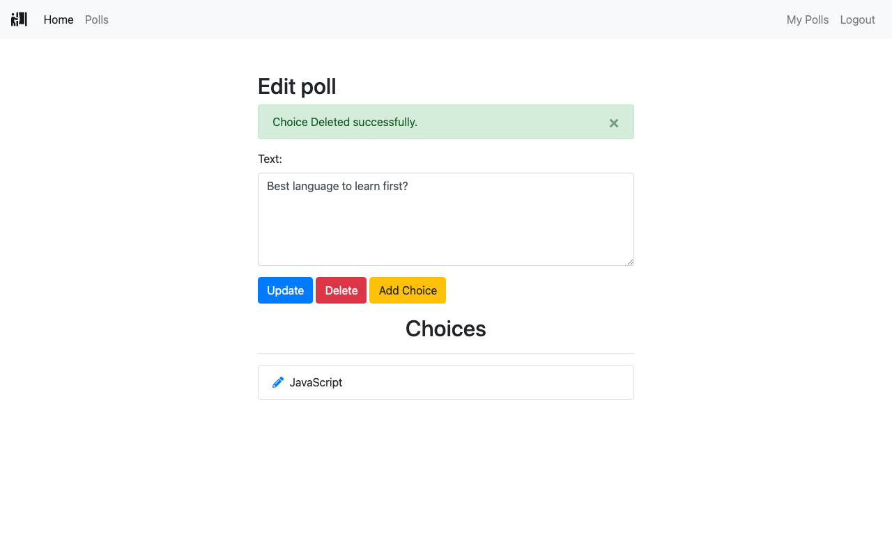

每个测试都是至少两步操作加一个对页面状态的真实断言，不是简单的"打开首页看标题"。五个测试全部通过：


过程中踩到三个坑：一是 Playwright 同步 API 在 asyncio 上下文里跑会触发 `SynchronousOnlyOperation`，靠 conftest 顶部那个环境变量解决；二是 text 字段是 textarea 不是 input；三是 `polls_add` view 要求 `polls.add_poll` 权限，所以在 alice fixture 里手动加了这个权限。

---

# Q6 — Smoke Test Plan

## 1. Objective

对这个应用来说，smoke 通过意味着最近一次 build 在最常用的路径上没有把核心功能弄挂，可以放心进入更深一层的回归测试。具体来说下面六条用户必经路径必须都通：任何人能打开首页、已注册用户能登录、登录后能看到 poll 列表、能进 poll 并投票成功、新用户能注册、用户能退出。只要有一条挂了，这次 build 就不进下一轮测试，直接打回。

## 2. Scope and Coverage

**In scope**：用户认证（注册 / 登录 / 退出）、poll 列表浏览、单次投票流程、静态首页。

**Out of scope**：poll 和 choice 的增删改、搜索排序分页、结果页百分比计算细节、"已投票"拦截逻辑、权限边界、跨分辨率/浏览器兼容、性能。

理由：smoke 只挡"build 是不是死了"，不挡"功能是不是完美"。增删改和边界条件是回归测试要覆盖的，不该让 smoke 跑半小时。

## 3. Approach

Hybrid，四个自动加两个手动：

| 类别 | 用例 | 工具 |
|---|---|---|
| 自动 | Home 200、Vote、Register、Logout（其中三个复用 Q5 的 Playwright spec） | Playwright + pytest-django |
| 手动 | Login、Poll list 渲染 | 浏览器 + checklist |

自动测试在 CI 里几秒跑完，是常态；剩下两个用人眼复核，因为它们涉及 navbar 状态切换和列表布局这种 selector 容易飘的视觉确认，与其写脆的 selector 不如花 30 秒看一眼。

## 4. Test Cases

| ID | 类别 | 用例 | Steps | Expected | Pass/Fail 标准 |
|---|---|---|---|---|---|
| SMK-01 | auto | Home page 200 | `GET /` | 200，渲染 navbar 加标题 | HTTP 200 且 navbar 可见 |
| SMK-02 | manual | Login | 登录页填 seeded 账号密码点 Login | 跳 `/`，navbar 显示 Logout | 5 秒内完成，无 5xx |
| SMK-03 | manual | Poll list 渲染 | 登录后访问 `/polls/list/` 目测 | 至少 1 个 poll 条目，Add 按钮可见 | 条目数 ≥ 1，按钮可见 |
| SMK-04 | auto | Vote 流程 | 登录→进 detail→选 choice→Submit | 跳结果页，"Total: 1 votes" 可见 | 结果页可见，count == 1 |
| SMK-05 | auto | Register 新用户 | 注册页填合法表单 Submit | 跳 login，User 表 +1 | 重定向命中 login，行存在 |
| SMK-06 | auto | Logout | 登录态下点 Logout | 跳 `/`，navbar 改回 Login/Register | Login 链接可见 |

四个自动用例都能复用 Q5 的 Playwright spec。

## 5. Test Deliverables

每次 smoke 跑完产出：pytest 终端输出（含每个 spec 的 PASS/FAIL）、JUnit XML 报告（CI 解析用）、Playwright 失败时的 trace、手动 checklist 的填表结果（执行人加时间戳）、以及任何 Fail 时立即开的缺陷单。

## 6. Environment and Resources

运行环境与 CI 一致：Python 3.13、Django 4.2.x、SQLite（内存测试库）、Chromium headless。不连生产库，用 `live_server` 起独立测试 server。测试数据每次 smoke 前 seed：一个 staff 用户、一个普通用户、一个 active poll 加 3 个 choice，写在 conftest 的 fixture 里自动建。机器要求：能跑 Django 加 Chromium、内存 1 GB 以上、不需要外网（除非装依赖）。

## 7. Schedule and Entry / Exit Criteria

**何时跑**：每次 push 到 main、每个 PR 合并前、release 分支切出前手动跑一遍、重大依赖升级后。

**Entry criteria**：代码通过 ruff lint、能 `pip install` 成功、`migrate` 不报错、dev server 起得来。

**Exit criteria**：六个用例全 Pass、pytest 退出码为 0、手动 checklist 两项都 Pass。任一不满足则 smoke fail，build 不进下游。

## 8. Risks and Contingency Plans

| Risk | 影响 | 应对 |
|---|---|---|
| dev server 起不来（端口冲突 / migrate 报错） | 自动用例全失败但非真问题 | pre-run 健康检查：`curl` 拿到 200 才继续 |
| Chromium 没装好 | 报错看起来像 app bug | CI 加 `playwright install --with-deps chromium` 并缓存 |
| 手动步骤被遗漏 | smoke 延期 | checklist 进提醒模板，PR comment 里勾选才放行 |
| smoke 测试自己有 bug | false fail 卡住 pipeline | 任何 smoke 改动都要 PR review |
| 偶发失败（网络抖动 / JS 慢） | 信任度下降 | 失败先手动 re-run，同一位置累计三次再判真挂 |
| 没人 review 手动结果 | 手动形同虚设 | 结果存到带签名的表单 / Issue 留 audit trail |

**Smoke 失败时的处置**：立刻给该 commit 打 `smoke-fail` label、通知开发当事人和 QA on-call、不准合依赖此 commit 的 PR、走 hotfix 修完重跑、若是测试自身 bug 由 QA 提 PR 修。

---

# Q7 — Integration Tests

跟 Q3 不同，这里完全不用 test double。两个测试都跑真 Django 测试库、真 URL routing、真 ORM，文件在 `qa_tests/test_integration.py`。

跑法：

```
python manage.py test qa_tests.test_integration -v 2
```

两个测试约 0.15 秒。

## 测试一：投票去重（View ↔ ORM ↔ DB）

**集成的组件**：HTTP 入口加 Django session/auth、`poll_vote` view、`Poll.user_can_vote` 应用层校验、Django ORM、SQLite 上的 `polls_vote` 表加 R3 重构加的唯一约束。

**如果没集成好会怎样**：如果 `user_can_vote` 逻辑写反，view 拦不住第二次投票，重复行就进库；如果只在 view 挡而 DB 没加唯一约束，任何绕过 view 的写入路径（管理后台、迁移脚本、并发竞争）都能产生重复行。这个测试同时覆盖 view 和 DB 两层。

```python
def test_second_vote_attempt_blocked_and_db_rejects_raw_duplicate(self):
    url = reverse("polls:vote", kwargs={"poll_id": self.poll.id})

    # 1) 第一次投票走完整 stack: view -> Vote(...).save() -> DB
    r1 = self.client.post(url, {"choice": self.c1.id})
    self.assertEqual(r1.status_code, 200)
    self.assertEqual(
        Vote.objects.filter(user=self.alice, poll=self.poll).count(), 1
    )

    # 2) 第二次投票被 view 层拦下: 重定向到 polls:list
    r2 = self.client.post(url, {"choice": self.c2.id})
    self.assertEqual(r2.status_code, 302)
    self.assertEqual(r2.url, reverse("polls:list"))

    # 3) 即便绕过 view 直接 ORM 写入, DB 唯一约束也会抛 IntegrityError
    with self.assertRaises(IntegrityError):
        with transaction.atomic():
            Vote.objects.create(
                user=self.alice, poll=self.poll, choice=self.c2
            )

    # 4) 表里始终只有一行
    self.assertEqual(
        Vote.objects.filter(user=self.alice, poll=self.poll).count(), 1
    )
```

裹一层 `transaction.atomic()` 是因为 `TestCase` 把每个测试方法包在事务里，一旦 `IntegrityError` 触发外层事务就坏了，内层 savepoint 回滚后外层才能继续跑后面的断言。

## 测试二：注册写入用户表（Form ↔ User table）

**集成的组件**：`create_user` view（R6 瘦身后）、`UserRegistrationForm` 的 clean_* 和 save、Django auth 的 `create_user`、SQLite 上的 `auth_user` 表。

**如果没集成好会怎样**：如果 form 的 `save()` 没调 `create_user`（比如有人改成 `create` 漏了密码 hash），表会有用户但密码是裸文本，登录全挂；如果查重逻辑在 form 挡住但 view 没正确处理 form invalid，会反复刷出错却不报错。测试先看"合法数据→数据库真多一行"，再看"重复用户名→行数不变加 form 有错"。

```python
def test_form_creates_user_row_and_rejects_duplicate_username(self):
    r1 = self.client.post(self.URL, {
        "username": "alicia",
        "email": "alicia@example.com",
        "password1": "secret",
        "password2": "secret",
    })
    self.assertEqual(r1.status_code, 302)
    self.assertTrue(User.objects.filter(username="alicia").exists())

    before = User.objects.count()
    r2 = self.client.post(self.URL, {
        "username": "alicia",
        "email": "someone-else@example.com",
        "password1": "secret",
        "password2": "secret",
    })
    self.assertEqual(r2.status_code, 200)
    self.assertEqual(User.objects.count(), before)
    self.assertIn(
        "Username already exists!",
        r2.context["form"].errors["username"],
    )
```

第二次提交特意换了新 email，确保拦下 form 的是 username 的查重而不是 email 的查重。

跟单测对比：Q3 用 fake/stub/mock 把依赖全替换掉，跑 0.002 秒，测的是"算法对不对"；Q7 走真 ORM 真 DB 跑 0.15 秒，测的是"逻辑接到 Django 和数据库上还工作不工作"，两件事都得测，谁也替代不了谁。

两个集成测试都通过：

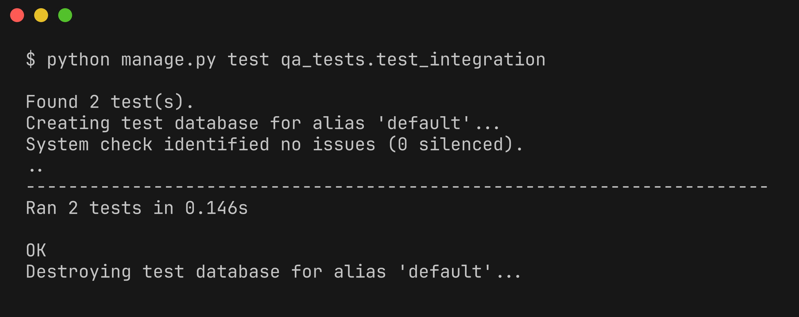

---

# Q8 — Code Smells

下面三个 smell 是我做 lint 和单测前后翻代码翻出来的，类型都不一样。这部分只是 review，不改代码；原始片段用 `git show HEAD:` 拉的上游原版做对照。

## Smell 1：Duplicated Code

| Section | Details |
|---|---|
| Code smell type | Duplicated Code |
| Location | `polls/views.py` 第 72/96/112/129/153/173/196/207 行 + `accounts/views.py` 第 43/47/51/55/57/63 行，共 14 处 |
| Why it's a smell | 同一个 Bootstrap class 字符串 `alert alert-success alert-dismissible fade show` 和它的 warning 版本被原样复制了 14 次，分散在两个 view 文件里。Bootstrap 升级要改 class 时得逐处找替换；写测试也只能用整串字符串断言，错一个空格就挂 |
| Proposed improvement | Extract Constant：把这两个字符串提到 `pollme/messages.py` 的 `SUCCESS_TAGS` / `WARNING_TAGS`，两个 view 各 import 一次，一处改全局生效 |

```python
# polls/views.py:71-73
messages.success(
    request, "Poll & Choices added successfully.", extra_tags='alert alert-success alert-dismissible fade show')

# accounts/views.py:62-64
messages.success(
    request, f'Thanks for registering {user.username}.', extra_tags='alert alert-success alert-dismissible fade show')
```

## Smell 2：Long Method / Multiple Responsibilities

| Section | Details |
|---|---|
| Code smell type | Long Method（多职责） |
| Location | `polls/models.py` 第 28–45 行，`Poll.get_result_dict` |
| Why it's a smell | 一个方法干三件事：算票数百分比、随机配 Bootstrap 颜色、内部 hardcode 颜色 list。最严重的是用 `secrets.choice` 选随机颜色——`secrets` 是加密用途的随机源，给 UI 配色用它语义就错了；而且随机源硬编码在方法里没有注入点，单测根本没法预期 alert_class 是哪个 |
| Proposed improvement | Extract Method 加依赖注入：拆成 `compute_poll_results(poll)`（只算数）和 `attach_alert_classes(results, rng)`（只配色，rng 可注入），测试时传一个返回固定值的 stub 就能让输出确定 |

```python
def get_result_dict(self):
    res = []
    for choice in self.choice_set.all():
        d = {}
        alert_class = ['primary', 'secondary', 'success',
                       'danger', 'dark', 'warning', 'info']
        d['alert_class'] = secrets.choice(alert_class)
        d['text'] = choice.choice_text
        d['num_votes'] = choice.get_vote_count
        if not self.get_vote_count:
            d['percentage'] = 0
        else:
            d['percentage'] = (choice.get_vote_count /
                               self.get_vote_count)*100
        res.append(d)
    return res
```

## Smell 3：Feature Envy

| Section | Details |
|---|---|
| Code smell type | Feature Envy |
| Location | `accounts/views.py` 第 29–65 行，`create_user` 函数体 |
| Why it's a smell | 这个 view 本该只做 HTTP 编排，却把"表单校验"这件 form 该干的事抢过来：从 cleaned_data 手动取字段，自己跑三个 if 检查密码匹配、用户名重复、邮箱重复，还用 `check1/check2/check3` 三个 flag 攒结果。结果 view 巨长（37 行），form 几乎空壳，测校验规则只能搭 HTTP request，form 自己测不出来 |
| Proposed improvement | Move Method：把校验逻辑搬回 form 的 `clean_username` / `clean_email` / `clean`，再加 `save()` 封装 `create_user`，view 瘦身成 `if form.is_valid(): form.save()` 这种 12 行标准写法 |

```python
def create_user(request):
    if request.method == 'POST':
        check1 = False
        check2 = False
        check3 = False
        form = UserRegistrationForm(request.POST)
        if form.is_valid():
            username = form.cleaned_data['username']
            password1 = form.cleaned_data['password1']
            password2 = form.cleaned_data['password2']
            email = form.cleaned_data['email']
            if password1 != password2:
                check1 = True
                messages.error(request, 'Password did not match!', ...)
            if User.objects.filter(username=username).exists():
                check2 = True
                messages.error(request, 'Username already exists!', ...)
            if User.objects.filter(email=email).exists():
                check3 = True
                messages.error(request, 'Email already registered!', ...)
            ...
```

`check1/check2/check3` 三个 flag 是 feature envy 最明显的标志——在 A 模块里用本地变量缓存 B 模块的校验结果，基本一定是逻辑放错了地方。

---

# Q9 — CI/CD Pipeline

平台用 GitHub Actions，配置在 `.github/workflows/ci.yml`，单 workflow 单 job，把 Q1 / Q3 / Q4 / Q5 / Q7 全跑一遍。

## Pipeline 步骤

| 顺序 | 步骤 | 对应题 | Fail 条件 |
|---|---|---|---|
| 1 | checkout + Python 3.12 + uv | 基础 | 装不上 |
| 2 | 装项目加依赖 | 基础 | requirements 装不上 |
| 3 | `playwright install --with-deps chromium` | Q5 | 浏览器装不上 |
| 4 | `ruff check .` | Q1 | 任何 lint warning |
| 5 | `manage.py migrate` | 基础 | migration 报错 |
| 6 | `coverage run ... test qa_tests.test_unit` + `coverage report` | Q3 | 单测失败 |
| 7 | `manage.py test qa_tests.test_integration` | Q7 | 集成失败 |
| 8 | `pytest qa_tests/ui/` | Q5 | UI 失败 |
| 9 | 装 k6 + seed + 起 server | Q4 准备 | server 起不来 |
| 10 | `k6 run performance/load.js` | Q4 | p95>500ms 或 p99>1000ms 或错误率>1% |

每一步任一 fail 整条 pipeline 就红，符合"在 lint / 测试失败时让 build 失败"的要求。作业要求覆盖 lint / unit / integration / performance / UI 五项，这里全覆盖。

触发条件是 push 到 main 加所有 PR。两个 artifact（coverage HTML 加 Playwright 截图）即便 fail 也上传，方便诊断。

## 一绿一红的演示

当前 `ruff check .` 是干净的，所以正常 push 会跑出绿。为了演示红，我故意在一个 `.py` 文件顶部加了一个没用到的 import 制造 F401，push 后 ruff 步骤报红、整条 build 失败；然后把那行删掉再 push，pipeline 回到全绿。

全绿的 run：

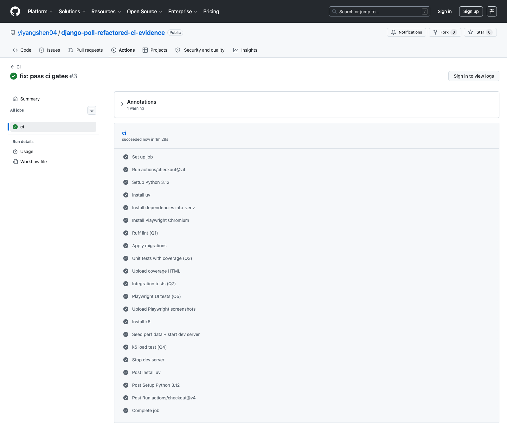

故意引入 lint 错误后失败的 run：

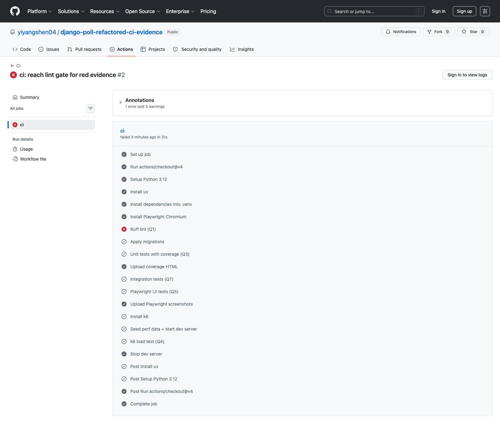

这里有几个取舍：没拆 job 并行（学生项目单 job 够用，拆开 yaml 复杂度不值）；没缓存 Playwright 浏览器（每次重装约 30 秒）；没分 deploy stage（作业范围只到 CI）；性能测试在 GitHub runner 上 CPU 有限，p95 在不同 run 之间可能波动，所以 CI 阈值留了较宽的容差。

---

# 附录：运行说明与 AI 使用声明

## 环境与运行

```bash
uv venv .venv
source .venv/bin/activate
uv pip install -r requirements.txt ruff coverage pytest pytest-django pytest-playwright openpyxl Pillow
playwright install chromium
python manage.py migrate
```

各项测试的命令：

| 想跑什么 | 命令 |
|---|---|
| ruff lint | `ruff check .` |
| 单元测试 | `python manage.py test qa_tests.test_unit` |
| 集成测试 | `python manage.py test qa_tests.test_integration` |
| Playwright UI | `pytest qa_tests/ui/` |
| 覆盖率 | `coverage run --source=polls,accounts manage.py test qa_tests.test_unit && coverage report` |
| k6 性能 | 先起 dev server，再 `k6 run performance/load.js` |

## 测试数量小结

九个单元测试（其中五个用 test double，覆盖 fake / stub / mock / spy 四种）、两个集成测试、五个 Playwright UI 测试、两个 k6 性能脚本、十五条 UAT 用例（覆盖四种黑盒技术），加上四处为可测性做的重构。

## AI 使用声明

按项目规定，生成式 AI 只允许用于应用代码。我用 AI 辅助过应用侧代码的少量改写（重构时的样板代码）。测试、测试计划和分析都是我自己写的。所有引用的外部资料（Stack Overflow、博客、文档）都在对应位置注明。
